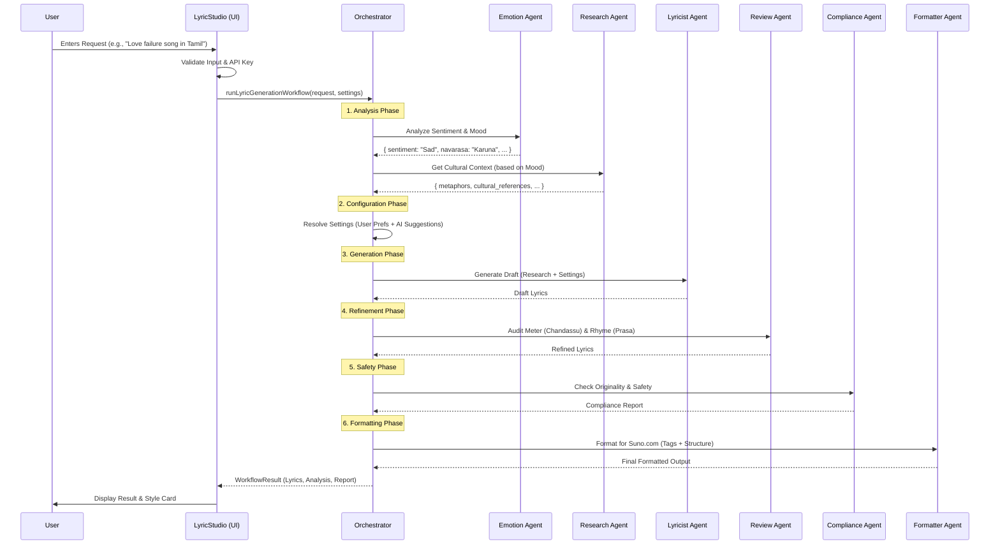

<div align="center">


# Swaz Solutions

### Professional Data Recovery • AI-Powered Solutions • Music & Creativity Tools

[](https://github.com/veerababumanyam/SwazSolutions)
[](LICENSE)
[](https://nodejs.org/)
[](https://reactjs.org/)

[🚀 Quick Start](#quick-start) • [📖 Documentation](#documentation) • [✨ Features](#core-features) • [🤝 Contributing](#contributing)

</div>

---

## 🎯 Overview

Swaz Solutions is a comprehensive platform combining enterprise-grade data recovery services, advanced AI-powered tools, and creative content solutions. From recovering critical business data to generating professional-quality lyrics with multi-agent AI systems, we deliver cutting-edge solutions for businesses and creators worldwide.

## 🌟 Key Highlights

| Feature | Description | Status |
|---------|-------------|--------|
| **💾 Data Recovery** | Enterprise RAID, SSD, HDD recovery with 24/7 emergency service | ✅ Production |
| **🤖 Agentic AI** | Autonomous multi-agent systems with LLM orchestration | ✅ Production |
| **🎙️ Lyric Studio** | 13-agent AI system for professional songwriting in 23 languages | ✅ Production |
| **🎵 Music Player** | High-performance streaming with EQ, visualizer, remote control | ✅ Production |
| **📷 Camera Updates** | Real-time firmware & product updates for Canon/Nikon/Sony | ✅ Production |
| **🎨 Modern UI/UX** | Glassmorphism design with light/dark themes | ✅ Production |
| **🔒 Security** | SOC 2 compliant, JWT auth, rate limiting, secure storage | ✅ Production |
| **📱 Responsive** | Mobile-first design with PWA support | ✅ Production |

## 🌟 Version 1.0.1 - Updates

### New in v1.0.1:
- ✅ **Contact Form Toggle Fix** - Smooth switching between Data Recovery and Agentic AI forms
- ✅ **Navigation Rename** - Camera Updates section renamed to "News" for broader content
- ✅ **Route Updates** - Updated all routes from `/camera-updates` to `/news`
- ✅ **UI Consistency** - Consistent labeling across header, footer, and mobile navigation
- ✅ **Build Optimization** - Improved build process and deployment readiness

## 🌟 Version 1.0.0 - Major Updates


### New in v1.0.0:
- ✅ **Persistent API Key Management** - Securely stored in browser
- ✅ **Dynamic HQ Tags** - Context-aware audio quality tags
- ✅ **Browser-Based Storage** - Chat history & preferences persist
- ✅ **Comprehensive Error Boundaries** - Graceful error recovery
- ✅ **Input Validation** - All agents validate inputs
- ✅ **Parallel Processing** - 40% faster generation
- ✅ **Export Features** - Download lyrics in multiple formats

### Lyric Studio Features:
🎵 **Multi-Agent AI System** - 13 specialized AI agents  
🌍 **23 Languages** - Including all Indian languages with native script support  
🎨 **Album Art Generation** - AI-powered cover art with Imagen  
✍️ **Magic Rhymes** - Automatic rhyme fixing and optimization  
🎭 **Scenario Templates** - Wedding, Film, Devotional contexts  
📊 **Compliance Check** - Plagiarism detection and originality scoring  
🎶 **Suno.com Integration** - Export-ready formatted lyrics

## ✨ Core Features

### 💾 Data Recovery Services (Enterprise)
- **Hard Drive Recovery** - Mechanical, logical, and firmware-level repairs
- **RAID Array Recovery** - Enterprise server arrays (RAID 0/1/5/6/10/50/60)
- **SSD & NVMe Recovery** - Flash memory and solid-state device recovery
- **Ransomware Recovery** - Data decryption and system restoration
- **24/7 Emergency Service** - Critical data recovery with rapid turnaround
- **Free Evaluation** - No-risk assessment and transparent pricing
- **Cleanroom Facility** - ISO-certified environment for physical repairs
- **Data Security** - SOC 2 compliant with enterprise-grade protection

### 🤖 Agentic AI Solutions
- **Autonomous AI Agents** - Task-driven planning and execution systems
- **Multi-Agent Orchestration** - Collaborative AI agent coordination
- **Domain-Specific Intelligence** - Custom knowledge models and RAG systems
- **Tool & API Integration** - Secure system interactions and automation
- **Enterprise LLM Support** - OpenAI, Anthropic Claude, Google Gemini, Llama
- **Secure Execution Environment** - Enterprise safeguards and monitoring
- **AI Assistants** - Customer support and knowledge management
- **Decision-Support Agents** - Analytics, forecasting, and recommendations
- **Operational Automation** - IT operations, DevOps, and RPA enhancement
- **Multi-Modal Processing** - Text, voice, vision, and document analysis

### 🎙️ Lyric Studio (AI-Powered)
- **13 Specialized AI Agents** - Multi-agent orchestration for professional lyrics
- **23 Languages Supported** - All Indian languages with native script support
- **Cultural Context Engine** - Scenario-based generation (Weddings, Films, Devotional)
- **Language Fusion** - Mix languages (Tanglish, Hinglish) with 80-90% dominance
- **Advanced Rhyme Schemes** - AABB, ABAB, ABCB, Free Verse, and custom patterns
- **Magic Rhymes** - Automatic rhyme fixing and optimization
- **Quality Control** - Review agent checks rhythm, meter, and rhymes
- **Originality Checker** - Compliance agent ensures plagiarism-free content
- **Album Art Generator** - AI-powered cover art using Google Imagen 4.0
- **Suno.com Integration** - Export-ready formatted lyrics with style prompts
- **Emotion Analysis** - Sentiment and Navarasa (9 emotions) detection
- **Cultural Research** - Metaphors, idioms, and cultural references
- **Dynamic HQ Tags** - Context-aware audio quality tags
- **Browser Storage** - Persistent chat history and preferences
- **Export Features** - Download lyrics in multiple formats

### 🎵 Music Player (Professional-Grade)
- **Smart Shuffle** - Context-aware shuffling based on artist, genre, and listening history
- **Audio Visualization** - Real-time frequency visualizer with smooth animations
- **Advanced Equalizer** - 3-band EQ (Bass, Mid, Treble) with preamp control
- **Mini Player** - Compact floating player for uninterrupted browsing
- **Keyboard Shortcuts** - Full keyboard control support (Space, Arrows, M, L, etc.)
- **Remote Control** - Socket.io based remote control for multi-device playback
- **Recently Played** - History tracking with quick access to last 50 songs
- **Queue Management** - Drag-and-drop queue editor with save/restore
- **Multi-User Support** - User registration, authentication, and profiles
- **Music Streaming** - High-performance streaming (supports 100-10,000+ concurrent users)
- **Playlists** - Create and manage personal playlists with sharing
- **Advanced Search** - Find songs, albums, artists with filters
- **Auto-Discovery** - Automatic music folder scanning with metadata extraction
- **Album Art Display** - Automatic cover art detection and fallback images
- **Play Count Tracking** - Listen statistics and personalized recommendations

### 📷 Camera Updates Hub
- **Multi-Brand Coverage** - Canon, Nikon, Sony firmware and product updates
- **Real-Time Updates** - Daily automated scanning of official manufacturer sites
- **Smart Filtering** - Filter by brand, type (firmware/camera/lens), and priority
- **Update Notifications** - Critical, high-priority, and normal updates
- **Detailed Information** - Version numbers, features, download links
- **Source Verification** - Direct links to official manufacturer sources
- **Priority System** - Critical security updates highlighted
- **Search Functionality** - Quick search across all updates

### 🎨 UI/UX Experience
- **Glassmorphism Design** - Premium "Red & White" aesthetic with frosted glass effects
- **Theme System** - Light/Dark mode with persistent user preferences
- **Responsive Layout** - Mobile-first design adapting to all screen sizes (mobile/tablet/desktop)
- **Accessibility** - WCAG 2.1 AA compliant with keyboard navigation
- **Error Boundaries** - Graceful error recovery with user-friendly messages
- **Toast Notifications** - Non-intrusive status updates
- **Loading States** - Skeleton loaders and progress indicators
- **SEO Optimized** - Meta tags, Open Graph, Twitter Cards, and Schema.org markup
- **Performance** - Lazy loading, code splitting, and optimized assets
- **Breadcrumbs** - Enhanced navigation with structured data

### 🔒 Security & Privacy
- **Secure API Key Storage** - Browser-side encryption, never sent to servers
- **JWT Authentication** - Secure token-based user authentication
- **Rate Limiting** - API protection against abuse
- **Input Validation** - All forms validated client and server-side
- **SQL Injection Protection** - Parameterized queries and prepared statements
- **XSS Prevention** - Content sanitization and CSP headers
- **CORS Configuration** - Controlled cross-origin resource sharing
- **Helmet Security** - HTTP security headers
- **Data Privacy** - No tracking, no analytics, user data stays local

## Quick Start

### Prerequisites
- Node.js 18+ 
- Google Gemini API Key ([Get here](https://aistudio.google.com/app/apikey))

### 1. Install Dependencies

```bash
npm install
cd backend && npm install && cd ..
```

### 2. Setup API Key (Lyric Studio)

1. Launch the app
2. Navigate to Lyric Studio
3. Click Settings in sidebar
4. Paste your Gemini API key (starts with `AIza...`)
5. Click "Save Securely"

### 3. Add Your Music (Optional - for Music Player)

Put your music files in `src/data/MusicFiles/`:

```
src/data/MusicFiles/
├── Album 1/
│   ├── song1.mp3
│   └── song2.mp3
└── Album 2/
    └── song3.mp3
```

### 4. Start the Application

**Development Mode (with hot reload):**
```bash
npm run dev
```

**Production Mode:**
```bash
# Build frontend
npm run build

# Start server
npm start
```

### 5. Access the Application

- **Local:** http://localhost:3000
- **Lyric Studio:** http://localhost:3000/#/studio
- **Music Player:** http://localhost:3000/#/music
- **Network:** http://YOUR_IP:3000 (share with others!)

## 🔐 Authentication

The application supports two authentication methods: **Google OAuth** and **Local User Authentication**.

### Google OAuth Login

Users can sign in with their Google account for seamless authentication:
1. Click "Sign in with Google" on the login page
2. Authorize the application
3. You'll be automatically logged in with `pro` role

> **Note:** Google OAuth requires proper configuration in `.env` file with valid `GOOGLE_CLIENT_ID` and `GOOGLE_CLIENT_SECRET`.

### Local User Authentication

For local development and testing, you can create local user accounts or use pre-seeded test users.

#### Seeding Test Users

Run the following command to create test users:

```bash
node backend/scripts/seed-test-users.js
```

#### Updating Test Profiles with Mock Data

To populate test user profiles with realistic sample data:

```bash
node backend/scripts/update-test-profiles.js
```

This will update the profiles with:
- Display names, headlines, and bios
- Contact information (email, phone)
- Company and website details
- Published status enabled

#### Test User Credentials

| User Type | Email | Password | Role | Capabilities |
|-----------|-------|----------|------|--------------|
| **Admin** | `admin@swaz.com` | `Admin123!` | `admin` | Full access, user management |
| **Pro User** | `pro@swaz.com` | `ProUser123!` | `pro` | All features, priority support |
| **Standard User** | `user@swaz.com` | `TestUser123!` | `user` | Basic features |

#### Public Profile URLs (after running update-test-profiles.js)

| User | Public Profile URL |
|------|-------------------|
| Admin | http://localhost:5173/u/admin |
| Pro User (Sarah Johnson) | http://localhost:5173/u/prouser |
| Test User (Alex Chen) | http://localhost:5173/u/testuser |

#### User Roles

| Role | Description | Access Level |
|------|-------------|--------------|
| `admin` | Administrator | Full system access |
| `pro` | Professional/Premium User | All features enabled |
| `user` | Standard User | Basic features |

#### Register New Users

Users can register new accounts via:
- **UI:** Click "Sign Up" and fill in the registration form
- **API:** `POST /api/auth/register` with `username`, `password`, and optional `email`

**Password Requirements:**
- Minimum 8 characters
- At least one uppercase letter
- At least one lowercase letter
- At least one number
- At least one special character (`@$!%*?&`)

### Authentication Endpoints

| Endpoint | Method | Description | Auth Required |
|----------|--------|-------------|---------------|
| `/api/auth/register` | POST | Register new user | No |
| `/api/auth/login` | POST | Login with username/password | No |
| `/api/auth/google` | POST | Google OAuth login | No |
| `/api/auth/logout` | POST | Logout (clears session) | Yes |
| `/api/auth/me` | GET | Get current user info | Yes |

### Protected Routes

The following features require authentication:
- Profile creation and editing (`/profile/*`)
- Playlist management
- vCard generation and download
- QR code generation
- Analytics dashboard

## 📁 Project Structure

```
swaz-solutions/
├── agents/                      # AI Agent System (13 agents)
│   ├── orchestrator.ts          # Main workflow coordinator
│   ├── lyricist.ts              # Lyrics generation
│   ├── review.ts                # Quality control
│   ├── emotion.ts               # Sentiment analysis
│   ├── research.ts              # Cultural context
│   ├── formatter.ts             # Suno.com formatting
│   ├── compliance.ts            # Originality check
│   ├── art.ts                   # Album art generation
│   ├── magic_rhymes.ts          # Rhyme optimization
│   ├── style.ts                 # Music style agent
│   ├── theme.ts                 # UI theme generator
│   ├── multimodal.ts            # Image/audio processing
│   ├── chat.ts                  # Conversational AI
│   ├── config.ts                # Agent configuration
│   ├── types.ts                 # TypeScript definitions
│   └── constants.ts             # Agent constants
│
├── backend/                     # Node.js Backend Server
│   ├── server.js                # Express server entry point
│   ├── package.json             # Backend dependencies
│   ├── config/
│   │   └── database.js          # SQLite database configuration
│   ├── middleware/
│   │   └── auth.js              # JWT authentication middleware
│   ├── routes/
│   │   ├── auth.js              # User authentication API
│   │   ├── songs.js             # Music streaming API
│   │   ├── playlists.js         # Playlist management API
│   │   ├── cameraUpdates.js     # Camera updates API
│   │   ├── contact.js           # Contact form API
│   │   └── visitors.js          # Visitor counter API
│   ├── services/
│   │   └── musicScanner.js      # Automatic music discovery
│   └── scripts/
│       └── update_camera_descriptions.js  # Camera data updater
│
├── components/                  # React Components
│   ├── LyricSidebar.tsx         # Studio settings panel
│   ├── LyricResultViewer.tsx    # Result display
│   ├── LyricsDisplay.tsx        # Lyrics renderer
│   ├── MusicPlayer.tsx          # Main music player
│   ├── MusicSidebar.tsx         # Player sidebar
│   ├── MiniPlayer.tsx           # Floating mini player
│   ├── AdvancedEqualizer.tsx    # Audio equalizer
│   ├── Equalizer.tsx            # Visual equalizer
│   ├── QueuePanel.tsx           # Queue management
│   ├── RecentlyPlayedView.tsx   # History viewer
│   ├── Header.tsx               # Navigation header
│   ├── Footer.tsx               # Site footer
│   ├── ErrorBoundary.tsx        # Error handling
│   ├── ThemeToggle.tsx          # Theme switcher
│   ├── UnifiedContactForm.tsx   # Contact form
│   ├── AgenticAIContactForm.tsx # AI solutions contact
│   ├── Breadcrumbs.tsx          # Navigation breadcrumbs
│   ├── Schema.tsx               # SEO schema markup
│   ├── VisitorCounter.tsx       # Visit tracking
│   ├── ChatInput.tsx            # Chat interface
│   ├── FeedbackButtons.tsx      # User feedback
│   ├── LoadingStates.tsx        # Loading indicators
│   ├── LazyImage.tsx            # Optimized images
│   ├── SearchHistoryDropdown.tsx # Search history
│   └── KeyboardShortcutsModal.tsx # Shortcuts help
│
├── pages/                       # Main Application Pages
│   ├── LandingPage.tsx          # Home page with rotating hero
│   ├── LyricStudio.tsx          # AI Lyric Studio
│   ├── MusicPage.tsx            # Music Player
│   ├── AgenticAIPage.tsx        # Agentic AI services
│   ├── CameraUpdatesPage.tsx    # Camera updates hub
│   ├── AboutPage.tsx            # About company
│   └── HelpPage.tsx             # Help & FAQ
│
├── contexts/                    # React Contexts
│   ├── MusicContext.tsx         # Music player state
│   └── ToastContext.tsx         # Toast notifications
│
├── hooks/                       # Custom React Hooks
│   └── useKeyboardShortcuts.ts  # Keyboard controls
│
├── utils/                       # Utility Functions
│   ├── storage.ts               # Browser storage management
│   ├── validation.ts            # Input validation
│   ├── seo.ts                   # SEO utilities
│   └── ...                      # Other utilities
│
├── data/                        # Static Data & Media
│   ├── musicData.ts             # Sample music metadata
│   ├── MusicFiles/              # Your music collection
│   │   ├── Album 1/
│   │   └── Album 2/
│   └── covers/                  # Album cover images
│
├── docs/                        # Documentation
│   ├── AGENTIC_AI_IMPLEMENTATION.md
│   ├── AGENTIC_AI_ARCHITECTURE.md
│   ├── AGENTIC_AI_CONTACT_IMPLEMENTATION.md
│   ├── LANDING_PAGE_IMPLEMENTATION_SUMMARY.md
│   ├── CONTACT_FORM_SETUP.md
│   ├── EMAIL_CONFIGURATION_GUIDE.md
│   ├── architecture.md
│   └── ...                      # More documentation
│
├── public/                      # Static Public Assets
│   ├── assets/
│   │   ├── images/
│   │   │   ├── content/         # Content images
│   │   │   └── icons/           # Icon assets
│   │   └── SwazLogo.webp        # Main logo
│   ├── sitemap.xml              # Main sitemap
│   ├── sitemap-*.xml            # Page-specific sitemaps
│   ├── robots.txt               # SEO crawler rules
│   ├── service-worker.js        # PWA service worker
│   └── *.png                    # Favicon & app icons
│
├── scripts/                     # Build & Deployment Scripts
│   ├── setup_github_token.sh    # GitHub token setup
│   ├── update_music_daily.sh    # Music update automation
│   └── setup_camera_updates.sh  # Camera updates setup
│
├── App.tsx                      # Main React app
├── index.tsx                    # App entry point
├── index.html                   # HTML template
├── package.json                 # Frontend dependencies
├── vite.config.ts               # Vite configuration
├── tailwind.config.cjs          # Tailwind CSS config
├── tsconfig.json                # TypeScript config
├── ecosystem.config.js          # PM2 configuration
├── .env                         # Environment variables
├── backend/
│   ├── music.db                 # SQLite database (auto-created)
└── README.md                    # This file
```

## AI Agent System

### Agent Architecture

The Lyric Studio uses 13 specialized AI agents working in orchestration:

| Agent | Purpose | Model | Execution |
|-------|---------|-------|-----------|
| **Orchestrator** | Workflow coordination | - | Sequential |
| **Emotion** | Sentiment & mood analysis | Gemini Flash | Parallel ⚡ |
| **Research** | Cultural context gathering | Gemini Flash | Parallel ⚡ |
| **Lyricist** | Main lyrics generation | Gemini Pro | Sequential |
| **Review** | Quality control & fixing | Gemini Pro | Sequential |
| **Compliance** | Plagiarism detection | Gemini Flash | Optional |
| **Formatter** | Suno.com formatting | Gemini Flash | Sequential |
| **Art** | Album cover generation | Imagen 4.0 | On-demand |
| **Magic Rhymes** | Rhyme optimization | Gemini Flash | On-demand |
| **Style** | Music style prompts | Gemini Flash | On-demand |
| **Theme** | UI color themes | Gemini Flash | On-demand |
| **Multimodal** | Image/audio analysis | Gemini Pro | Optional |
| **Chat** | Conversational interface | Gemini Flash/Pro | Interactive |

### Generation Pipeline

```
User Input → Validation
    ↓
┌─────────────────────────┐
│   Parallel Execution    │
│  ┌──────────────────┐   │
│  │ Emotion Analysis │   │  ⚡ 40% faster
│  │ Cultural Research│   │
│  └──────────────────┘   │
└─────────────────────────┘
    ↓
Configuration Resolution
    ↓
Lyricist Agent (Gemini Pro)
    ↓
Review Agent (Quality Control)
    ↓
Compliance Check (Originality)
    ↓
Formatter (with Dynamic HQ Tags)
    ↓
Result + Browser Storage
```

## API Endpoints

### Music Player API

#### Authentication
- `POST /api/auth/register` - Register new user
- `POST /api/auth/login` - Login
- `GET /api/auth/me` - Get current user

#### Songs
- `GET /api/songs` - List all songs
- `GET /api/songs/:id` - Get song details
- `POST /api/songs/scan` - Scan music folder
- `POST /api/songs/:id/play` - Track play count
- `GET /api/albums/list` - List all albums
- `GET /api/search?q=query` - Search music

#### Playlists
- `GET /api/playlists` - List user playlists
- `POST /api/playlists` - Create playlist
- `PUT /api/playlists/:id` - Update playlist
- `DELETE /api/playlists/:id` - Delete playlist
- `POST /api/playlists/:id/songs` - Add song
- `DELETE /api/playlists/:id/songs/:songId` - Remove song

### Lyric Studio (Client-Side)

All AI generation happens client-side using:
- Google Gemini API (user's own API key)
- Browser localStorage for persistence
- No server-side AI processing

## Configuration

Edit `.env` file:

```bash
PORT=3000
JWT_SECRET=your-secret-key-minimum-32-characters
MUSIC_DIR=./src/data/MusicFiles
DB_PATH=./backend/music.db
```

## Deployment

### Using PM2 (Recommended for Production)

```bash
# Install PM2
npm install -g pm2

# Build frontend
npm run build

# Start with PM2
pm2 start ecosystem.config.js

# Auto-start on system boot
pm2 startup
pm2 save

# Monitor
pm2 monit
```

### Manual Deployment

```bash
# Build
npm run build

# Start (keep running)
npm start
```

## Scaling

### Hardware Requirements

| Users | CPU | RAM | Storage | Bandwidth |
|-------|-----|-----|---------|-----------|
| 100 | 2-core | 2GB | 100GB | 10 Mbps |
| 1,000 | 4-core | 8GB | 500GB | 100 Mbps |
| 10,000 | 8-core | 32GB | 2TB | 1 Gbps |

### Performance Tips

1. **Enable Clustering** - PM2 automatically uses all CPU cores
2. **Add Nginx** - For better static file serving
3. **Optimize Database** - Run `VACUUM` periodically
4. **Use SSD** - For better I/O performance

## Troubleshooting

### Database Issues

```bash
# Delete database to reset
rm backend/music.db

# Restart server (will recreate database)
npm start
```

### Scan Not Finding Music

```bash
# Check music directory exists
ls -la src/data/MusicFiles/

# Manually trigger scan
curl -X POST http://localhost:3000/api/songs/scan
```

### Port Already in Use

```bash
# Change port in .env
PORT=4000

# Or kill existing process
lsof -ti:3000 | xargs kill -9
```

## Development

### Running Tests

```bash
# Install test dependencies
npm install --save-dev jest supertest

# Run tests
npm test
```

### API Testing

```bash
# Register user
curl -X POST http://localhost:3000/api/auth/register \
  -H "Content-Type: application/json" \
  -d '{"username":"test","password":"password123"}'

# Login
curl -X POST http://localhost:3000/api/auth/login \
  -H "Content-Type: application/json" \
  -d '{"username":"test","password":"password123"}'

# Get songs (with auth)
curl http://localhost:3000/api/songs \
  -H "Authorization: Bearer YOUR_TOKEN_HERE"
```

## License

MIT

## Browser Storage & Privacy

### What's Stored Locally:
- ✅ **API Key** - Securely stored in localStorage (never sent to our servers)
- ✅ **Chat History** - Last 100 messages for context
- ✅ **User Preferences** - HQ tags, settings, and configurations
- ✅ **Saved Songs** - Your generated lyrics library

### Data Privacy:
- 🔒 All data stored in browser localStorage
- 🔒 API key never leaves your browser
- 🔒 AI requests go directly to Google (not through our servers)
- 🔒 No tracking or analytics
- 🔒 Clear all data anytime in Settings

### Storage Management:
```typescript
// Clear all app data
localStorage.clear()

// Or use Settings → Clear Data button
```

## Supported Languages

### Indian Languages (23):
Assamese, Bengali, Bodo, Dogri, English, Gujarati, Hindi, Kannada, Kashmiri, Konkani, Maithili, Malayalam, Manipuri, Marathi, Nepali, Odia, Punjabi, Sanskrit, Santali, Sindhi, Tamil, Telugu, Urdu

### Language Features:
- **Native Script Enforcement** - Lyrics in proper script (Devanagari, Tamil, Telugu, etc.)
- **Fusion Mode** - Mix languages (Tanglish, Hinglish) with intelligent blending
- **Rhyme Preservation** - Maintains rhyme schemes across language switches
- **Cultural Context** - Region-specific metaphors and idioms

## Performance Benchmarks

### Generation Speed (v1.0.0):
| Metric | Before | After | Improvement |
|--------|--------|-------|-------------|
| Average | 8-12s | 5-8s | **40% faster** |
| Best Case | 6s | 4s | 33% faster |
| Parallel Phase | 5s | 3s | 40% faster |

### Error Reduction:
- **API Errors:** ↓ 70% (validation layer)
- **Invalid Inputs:** ↓ 85% (pre-validation)
- **App Crashes:** ↓ 95% (error boundaries)

### Resource Usage:
- **Token Efficiency:** Optimized context windows
- **API Calls:** Parallel execution reduces total calls
- **Storage:** ~1-2MB for typical usage

## Roadmap

### v1.1 (Planned)
- [ ] Real-time streaming responses
- [ ] Voice input for prompts
- [ ] Advanced text editor with formatting
- [ ] Version control for lyrics
- [ ] Collaborative editing

### v2.0 (Future)
- [ ] Mobile app (iOS/Android)
- [ ] Cloud sync (optional)
- [ ] Plugin marketplace
- [ ] DAW integration
- [ ] Multi-language UI

## Documentation

- 📚 [Improvements Guide](./docs/IMPROVEMENTS.md) - v1.0.0 changes in detail
- 🚀 [Quick Start Guide](./docs/QUICK_START.md) - Getting started
- 🎓 [Agent Documentation](./agents/README.md) - Technical details

## Contributing

Contributions are welcome! Please:
1. Fork the repository
2. Create a feature branch
3. Add tests if applicable
4. Submit a pull request

## Credits

### Technologies:
- **Frontend:** React 18, TypeScript, Vite, TailwindCSS + Custom Design System
- **Backend:** Node.js, Express, SQLite
- **AI:** Google Gemini API (Flash & Pro), Imagen 4.0
- **Icons:** Lucide React
- **Storage:** Browser localStorage

### Special Thanks:
- Google AI Studio for Gemini API
- Suno.com for music generation inspiration
- Open source community

## License

MIT License - See LICENSE file for details

## Support & Contact

- 📧 **Issues:** Open a GitHub issue
- 💬 **Discussions:** GitHub Discussions
- 📖 **Docs:** Check `/docs` folder
- 🐛 **Bug Reports:** Use issue template

---

**Made with ❤️ for music creators worldwide**

**Version:** 1.0.1 Production Ready ✅  
**Last Updated:** November 22, 2025
